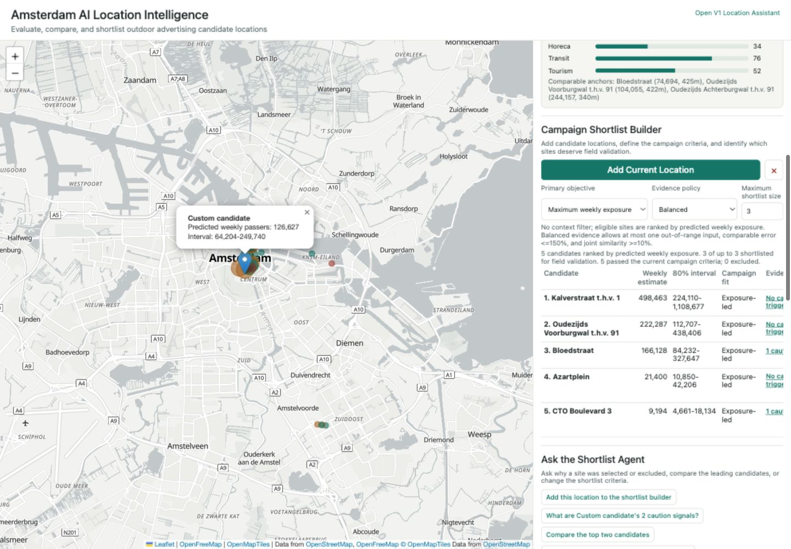
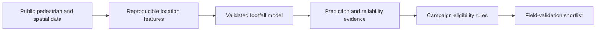

# Amsterdam OOH Location Intelligence

_Evidence-based site screening and campaign shortlisting for outdoor advertising in Amsterdam._

> **Portfolio case study:** This repository documents the design, implementation, validation, and engineering decisions behind an end-to-end location-intelligence product.



## In 30 seconds

Media planners need to prioritize candidate advertising locations before they have complete screen, inventory, and price data. This project turns public pedestrian counts and location context into a transparent first-pass decision workflow.

1. Select an Amsterdam coordinate.
2. Estimate typical weekly pedestrian exposure.
3. Inspect the prediction interval and local reliability evidence.
4. Compare saved candidates for a campaign objective.
5. Produce an evidence-filtered shortlist for field validation.

The result is a static interactive dashboard backed by a reproducible Python pipeline. It supports screening and relative ranking; it does not claim to predict campaign ROI.

**Portfolio highlights:** geospatial feature engineering · robust regression · leave-one-location-out validation · uncertainty communication · deterministic agent tools · product-oriented dashboard

- [Open the live dashboard](https://shaoxuan-shi.github.io/ai-location-intelligence-ads/)
- [Product brief](docs/product_brief.md)
- [Architecture](docs/architecture.md)
- [Methodology](docs/methodology.md)
- [Model card](docs/model_card.md)
- [Results and failure cases](docs/results_summary.md)

When GitHub Pages is enabled, the repository root opens the live dashboard automatically through `index.html`.

## Business value

The tool helps a commercial analyst answer three early-stage questions:

- Which candidate locations deserve field validation first?
- What evidence supports or weakens each estimate?
- How does the shortlist change for exposure, tourism, retail, or commuter campaigns?

Campaign rules remain separate from the footfall model. Business preferences filter and rank existing evidence; they do not alter the predicted traffic.

## Key results

The model is trained on 65 weeks of Amsterdam Crowdmonitor history and 25 usable location anchors. Every reported held-out prediction is made without training on that location.

| Measure | Result |
| --- | ---: |
| Selected model | Huber-Ridge log-linear regression |
| LOOCV RMSE on log scale | 0.567 |
| Mean-baseline LOOCV RMSE on log scale | 1.506 |
| Median held-out percentage error | 33.2% |
| LOOCV rank correlation | 0.874 |

The model is useful for relative screening and ranking, but it is not precise enough to replace fieldwork. Large local errors remain visible instead of being hidden behind one confidence score. The [results summary](docs/results_summary.md) documents model comparisons, rejected features, and the largest failure cases.

## Product capabilities

- Estimate typical weekly passers for a map-selected location
- Show an approximate 80% prediction interval
- Report comparable-anchor support, similar-anchor error, historical stability, and extrapolation evidence
- Compare candidates using retail, horeca, transit, tourism, and shopping-area context
- Filter and rank candidates for four campaign objectives and three evidence policies
- Explain shortlist status, caution signals, comparable anchors, and model drivers
- Keep all numerical answers grounded in deterministic model artifacts

## Architecture



The published dashboard is static: model coefficients, compact features, validation evidence, and product rules are bundled into the generated HTML. See the [architecture note](docs/architecture.md) for component responsibilities.

## Run locally

The committed dashboard does not require a package install.

```bash
make serve
```

Open [http://127.0.0.1:8767/dashboard_agent.html](http://127.0.0.1:8767/dashboard_agent.html). Internet access is needed for the map libraries and basemap; the model outputs and location features are bundled into the page.

## Verify the repository

The core pipeline uses the Python standard library.

```bash
make verify
```

This compiles the Python source and runs unit tests for statistical helpers, geometry, coordinate boundaries, model artifacts, output schemas, prediction intervals, and published-dashboard contracts. GitHub Actions runs the same command on every push and pull request.

## Rebuild the model

To download the public source data and regenerate the core model and dashboard:

```bash
make pipeline
```

To rebuild from data already cached in `data/raw/`:

```bash
make rebuild
```

Raw source files are intentionally excluded from version control. The committed processed tables, model summaries, and dashboard make the result reviewable without a roughly 200 MB data download. See [data/README.md](data/README.md) for source and file details.

## Repository guide

```text
app/                 Current dashboard plus preserved product iterations
data/processed/      Compact modeling tables
docs/                Product, architecture, method, model, and results notes
outputs/tables/      Model artifacts and experiment summaries
src/                 Data, feature, modeling, evaluation, and UI pipeline
tests/               Core logic and repository-contract tests
```

`app/dashboard_agent.html` and `src/generate_dashboard.py` are the current V2 product. `dashboard.html` and `generate_dashboard_assistant_v1.py` retain the earlier V1 product iteration.

## Model and product boundaries

- Training data is small and historical: 25 anchors from 2023-01-02 to 2024-03-25.
- POI and accessibility variables are proxies for pedestrian movement.
- The model does not observe screen direction, visibility, obstruction, dwell time, media cost, availability, or audience demographics.
- Estimates are for Amsterdam and should not be transferred to another city without recalibration.
- Predictions describe association and screening value, not causal campaign lift.

This is an early-stage location decision tool, not a final media-buying or campaign-ROI system. The [decision-gap note](docs/limitations.md) explains what should be checked during field validation.

## Data sources

- [Amsterdam Open Data API](https://api.data.amsterdam.nl/v1) for Crowdmonitor and official spatial context
- [OpenStreetMap](https://www.openstreetmap.org/copyright) for shops, tourism, lodging, and transit context

## License

Original code and documentation are available for portfolio evaluation under the [Portfolio Source License](LICENSE). Third-party datasets and services remain subject to their original provider terms.
