# Architecture

The repository keeps modeling, product rules, and presentation separate so that campaign preferences cannot silently change the traffic estimate.

```mermaid
flowchart LR
    sources["Amsterdam Open Data and OpenStreetMap"] --> fetch["Fetch and cache"]
    fetch --> features["Location feature pipeline"]
    features --> experiments["Target and feature experiments"]
    experiments --> model["Huber-Ridge model artifact"]
    model --> evaluator["Candidate evaluator"]
    evaluator --> evidence["Prediction and reliability evidence"]
    evidence --> rules["Campaign eligibility rules"]
    rules --> dashboard["Static shortlist dashboard"]
```

## Runtime boundary

The published dashboard is a static application. Model coefficients, compact location features, validation evidence, and shortlist rules are bundled into the generated HTML. A live model server is not required. Internet access is used only for map libraries and basemap tiles.

## Main components

| Component | Responsibility |
| --- | --- |
| `src/fetch_data.py` | Download and cache public source data |
| `src/build_features.py` | Build reproducible location features |
| `src/target_model_experiments.py` | Audit targets and robust-model variants |
| `src/feature_experiments.py` | Compare candidate feature sets |
| `src/model_weekly_passers.py` | Train, validate, and serialize the selected model |
| `src/evaluate_location.py` | Apply the same feature and model logic to a new coordinate |
| `src/generate_dashboard.py` | Generate the self-contained product dashboard |

## Decision boundary

The model estimates typical weekly pedestrian exposure. Campaign objectives are applied afterward as transparent eligibility filters. Screen visibility, price, availability, audience demographics, and ROI remain external inputs that require operational data or field validation.
